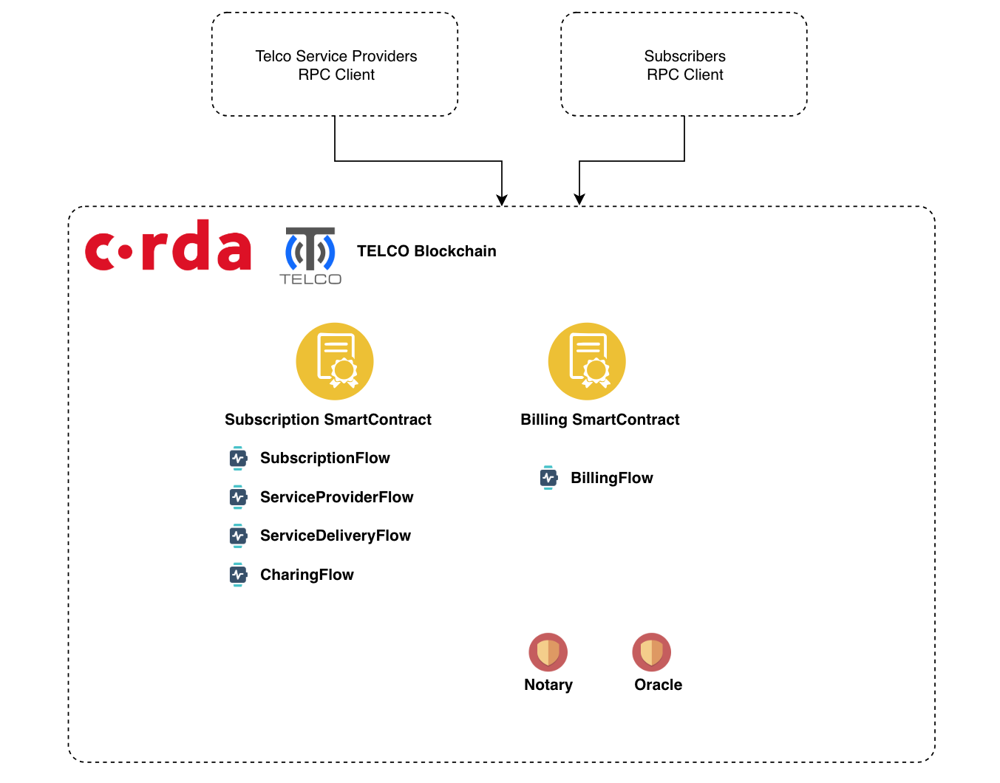
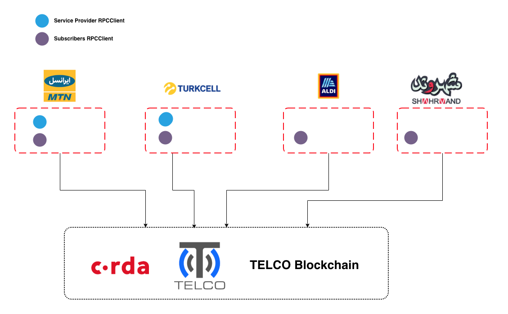

# Telecommunication On Corda




# Real World Model



# Useless Commands

```bash

flow start CashIssueFlow amount: $1000, issuerBankPartyRef: 1234, notary: "O=Controller, L=London, C=GB"

start CashIssueFlow amount: $1000, issuerBankPartyRef: 1234, notary: "O=Controller, L=London, C=GB" 


```

# Useless Notes
```bash

# For Access Database update node.conf file 

h2Settings {
    address: "localhost:0"
}


# Corda Default Keystore Password
cordacadevpass

# Enable Remote Debugging on Corda Node

java -Dcapsule.jvm.args="-agentlib:jdwp=transport=dt_socket,server=y,suspend=y,address=5005" -jar corda.jar

```